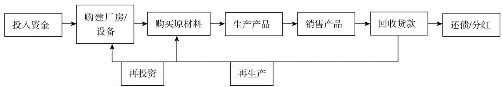
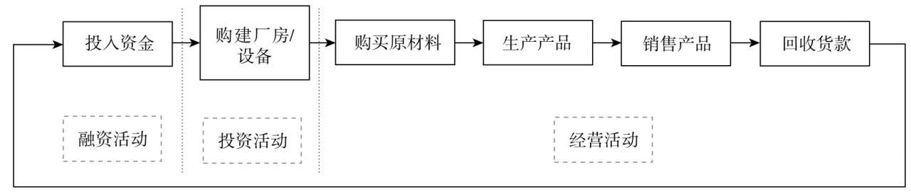
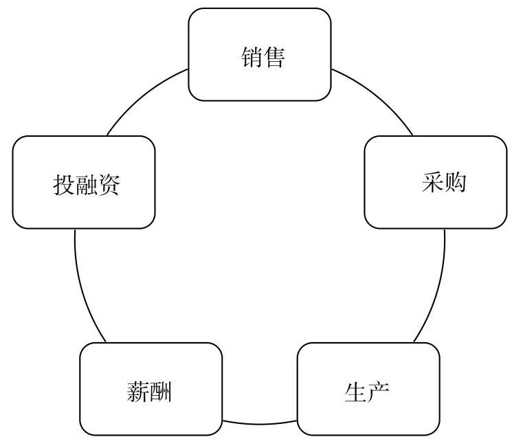

# 肖星的财务思维课

## 了解财务知识，看清企业兴衰

如何站在财务人的角度去看一家企业呢？

不管是餐饮、建筑、软件或是服务公司，从本质上来看，和制造业企业都非常相似。在财务人眼中，这些企业有一个共同点，那就是，所有的企业都经历着一个从投入资金到回收货款的过程，循环往复、周而复始、永不停息，直到企业关门。为了更加简单的了解一家企业，我们把一家企业的经营过程简化一下如下

企业经营主要做三件事。第一件事，企业的投资人（或股东）把钱投入企业，为生产经营做准备，我们称为**融资活动**。第二件事，企业用这些钱购买厂房、设备等基础设施，这种事并不会每天都发生，我们称为**投资活动**。第三件事，企业每天都在上演，那就是购买原材料、生产产品、销售产品、回收货款……我们称为**经营活动**。所以，企业纷繁复杂的各种交易和经济活动，在财务人眼中只有三类，那就是经营活动、投资活动和融资活动

现在，我们大致了解一家企业的经营过程了，同时也了解了资金在企业内的流转过程，接下来，我们将了解每项经济活动与财务数据之间有什么关系。我们将把企业的业务分成五大模块：**销售**、**采购**、**生产**、**薪酬**、**投融资**，来分别讨论这五大业务模块背后的财务数据。

## 认清行业大势，把脉客户关系

## 洞察产业链条，挖掘采购潜力

## 打磨生产流程，构筑竞争优势

## 统筹薪酬激励，凝聚团队力量

## 弄潮资本市场，助你如虎添翼

## 鸟瞰财务报表，掌控企业大局

## 构筑财务思维，实现价值提升

