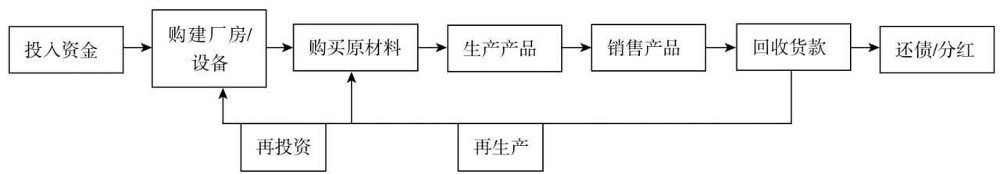
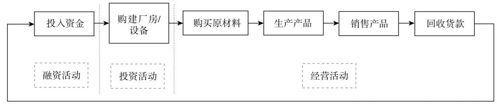
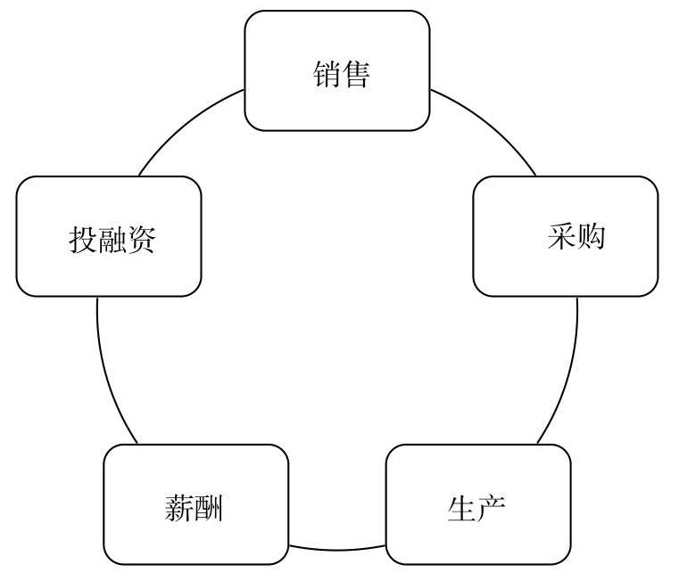
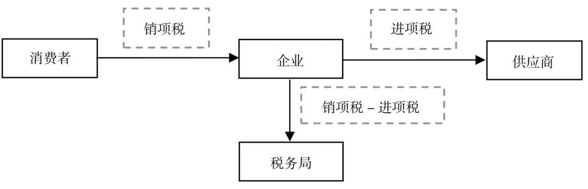
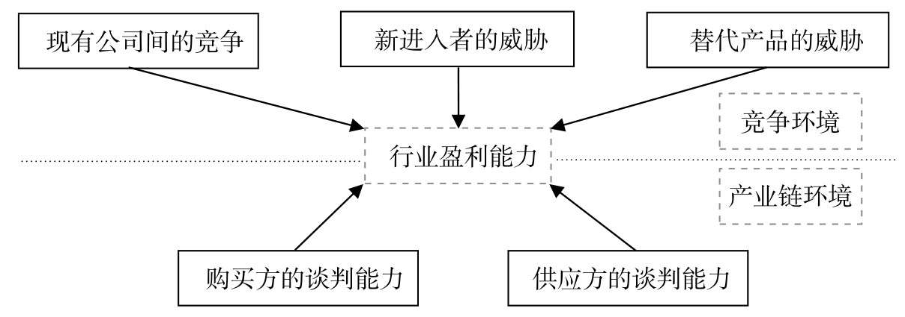

# 肖星的财务思维课

## 了解财务知识，看清企业兴衰

### 财务人眼里的世界

如何站在财务人的角度去看一家企业呢？

不管是餐饮、建筑、软件或是服务公司，从本质上来看，和制造业企业都非常相似。在财务人眼中，这些企业有一个共同点，那就是，所有的企业都经历着一个从投入资金到回收货款的过程，循环往复、周而复始、永不停息，直到企业关门。为了更加简单的了解一家企业，我们把一家企业的经营过程简化一下如下

企业经营主要做三件事。第一件事，企业的投资人（或股东）把钱投入企业，为生产经营做准备，我们称为**融资活动**。第二件事，企业用这些钱购买厂房、设备等基础设施，这种事并不会每天都发生，我们称为**投资活动**。第三件事，企业每天都在上演，那就是购买原材料、生产产品、销售产品、回收货款……我们称为**经营活动**。所以，企业纷繁复杂的各种交易和经济活动，在财务人眼中只有三类，那就是经营活动、投资活动和融资活动

现在，我们大致了解一家企业的经营过程了，同时也了解了资金在企业内的流转过程，接下来，我们将了解每项经济活动与财务数据之间有什么关系。我们将把企业的业务分成五大模块：**销售**、**采购**、**生产**、**薪酬**、**投融资**，来分别讨论这五大业务模块背后的财务数据。

## 认清行业大势，把脉客户关系

**销售**是企业中最重要的一项业务，只有将产品卖出去，企业才能实现收益。

### 客户

#### 卖什么

企业既可以卖商品，也可以卖服务；可以卖有形商品，也可以卖无形商品；可以卖自产商品，也可以卖外购商品。

#### 把东西卖给谁

可以把企业客户分成两种类型：一种是其他企业（即2B），另一种是个人消费者（即2C）。

#### 怎么卖、如何收款

常见的收款方式有：一手交钱，一手交货（即现销）；先付款，再发货（即预收）；先发货，再付款（即赊销，也是最常见的）；分期付款。

### 竞争对手

#### 竞争对手在哪里

它可以有三个来源：同行业的公司、行业新进入者、替代产品提供者。

#### 竞争会给我们造成什么影响

它会对价格产生冲击，会导致产能过剩与客户议价能力的提升。

#### 面对竞争，我们可以做些什么

可以实施两种不同类型的战略：成本领先战略和差异化战略。成本领先战略需要将成本降到比所有竞争对手都低，以低价吸引顾客；差异化战略需要让产品和服务具备某方面的独特性，吸引顾客为此付高价。

#### 从财务的视角看竞争战略是什么样的

成本领先战略是薄利多销，即低效益（低毛利率）、高效率（高周转率），也称效率制胜战略；差异化战略正好相反，是效益制胜战略，高效益（高毛利率）、低效率（低周转率）。

### 应收账款

#### 如何管好应收账款

可以通过应收账款回收周期来了解企业在销售业务的组织和效率方面的差异；可以通过应收账款来评判客户的价值；可以通过保理业务将应收账款出售给银行，从而盘活应收账款。

#### 钱收不回来怎么办

可以按照应收账款的一定比例估计坏账，对此，企业拥有较大的自主决策权；计提坏账会减少当期的利润，也会减少资产；如果已经计提的坏账日后收回，收回当年的利润就会增加，这也可能导致会计利润的操纵。

#### 应收账款背后有什么秘密

应收账款和其他应收款都可能被用来调节利润。比如，在以下情况下，都有可能会产生通过计提坏账操纵利润的现象：企业想要平滑利润，企业新换总经理，国有企业出售股权。其他应收款更是装着很多企业不方便拿到台面上来的东西，隐藏着更大的秘密。

#### 企业平滑利润的方法

最常见的一种目的就是避免利润的大幅波动。如果一家公司今年盈利1亿元，明年亏损2000万元，第三年盈利3000万元，第四年亏损1亿元，投资者恐怕会觉得这家公司太不靠谱了。如果公司管理层利用坏账的方法，在盈利1亿元的时候，计提一部分坏账把利润降下来，第二年亏损的时候，再转回坏账把利润做上去，就能大大地减少利润的波动，让利润看起来是一个稳定增长的趋势。上市公司为了避免亏损，或避免因连续亏损而被摘牌，也会采用这样的方式。

## 洞察产业链条，挖掘采购潜力

企业所有的业务都可以被简化成一个从现金到现金的周而复始的循环，**采购**业务是这个循环的前部分。

### 采购业务在财务上的表现

#### 记什么

| 支付方式           | 采购方                                     | 销售方                           |
| ------------------ | ------------------------------------------ | -------------------------------- |
| 一手交钱，一手交货 | 资产项：存货(+)，货币资金（-）             | 资产项：存货(-)，货币资金（+）   |
| 先拿货，再付款     | 资产项：存货（+） 负债项：应付票据（+） | 资产项：存货（-），应收票据（+） |
| 先付款，再拿货     | 资产项：预付账款（+），货币资金（-）       | 资产项：货币资金（+），存货（-） |

#### 什么时候记

采购货物的企业通常在收货时进行会计记录。需要说明的是，销售方是在发货时记录收入，而采购方需要等到收货时才记购进的存货，中间往往会有一个时间差。

#### 怎么记，记多少

企业采购商品的时候，期间会产生除商品外的其他费用，比如运费、增值税等。因此

**原料采购成本 = 原料费 + 运费 + 装卸费 + 保险费 + ... + 增值税**

供应商的资产项会记入原料费+增值税，其中增值税会记入负债项-**应交税费**

这里会产生一个新的问题，由于任何的采购事项都由购买方负担增值税，那么企业购进的原材料已经交过了税，当它把原材料加工成商品卖给客户，客户又通过企业再交了一部分税款。企业需要交给税务局的税款究竟是多少呢？

已经交给上游供应商企业的那部分增值税，我们称为**进项税**。在销售的时候从客户收取的这部分增值税，我们称为**销项税**。企业应缴纳的税款，应该是从客户收取的增值税减去已经交给供应商的增值税，即销项税与进项税的差额

**企业应缴纳增值税 = 销项税 - 进项税**

如果企业在购买原料时，供应商无法提供增值税发票（进项税），那么就会提高企业的整体税收

### 供应商的谈判能力

#### 供应商谈判能力的影响因素

一般而言，原材料市场竞争越激烈，供应商卖东西越难，对我们就越有利；反之，行业供不应求会使供应商谈判能力上升。而供应商行业集中度越高，规模越大，供应商谈判能力就越强。(供求关系)

#### 供应商谈判能力对财务影响

供应商的谈判能力会影响采购价格，进而影响毛利率，同时也会影响付款条件。供应商谈判能力越强，越要求企业提前付款、付现金甚至预付款项，不太能允许企业赊欠，因而企业的应付款越少。

| 供应商VS企业（采购方） | 企业（采购方）的财务表现   | 原因                               |
| ---------------------- | -------------------------- | ---------------------------------- |
| 供应商强势，采购方弱势 | 预付款较多                 | 上游供不应求或者上游企业规模特别大 |
| 供应商与采购方势均力敌 | 预付款少，但也没什么应付款 | 上游为一般竞争行业且行业集中度不搞 |
| 供应商弱势，采购方强势 | 应付款较多                 | 上游供过于且规模不太大             |

#### 行业环境的分析框架：五力图

五力图，顾名思义就是由五种力量来决定行业的盈利能力：现有公司间的竞争、新进入者的威胁、替代产品的威胁、购买方的谈判能力和供应方的谈判能力。仔细分析，这五种力量其实来自于两个方面：一个方面是**竞争环境**，另一个方面是**产业链环境**

竞争环境方面：企业面临的首要竞争是同行业公司的竞争，它们与企业在同一个行业里，提供相似的产品或服务。其次是新进入者的威胁，本来不在同一行业中的企业因为该行业赚钱而被吸引进来，于是带来了竞争压力。常常被忽略的是替代品竞争。

产业链环境方面：上游就是供应商，下游就是客户（购买方）。我们和供应商以及客户的关系，决定了我们处在怎样的产业链环境中。

以上五种力量共同决定了行业的盈利能力，也因此对很多财务数据产生影响，主要表现在毛利率、应收款/预收款（对客户）、应付款/预付款（对供应商）等指标上。

### 其他采购活动费用

#### 其他物品的采购

这里主要介绍两个，一是不属于原材料的物品；二是一些特殊的存货，通常指活的动物和植物，会计上我们称之为生物资产，其中生产性的生物资产属于固定资产，消耗性的生物资产属于存货

#### 销售费用

企业为达成产品的销售所产生的费用，例如企业销售员工工资、奖金、提成，出差的差旅费，请客户吃饭的业务招待费，公司广告促销费，这些支出都属于销售费用。

**销售费用水平可以反映企业渠道成本的高低**

#### 管理费用

从会计角度看，除了企业的一线生产部门和销售部门，其他部门都可以算作管理部门。其产生的费用成为管理费用，例如工资、培训、差率费、办公场地的租赁费等。

**管理费用水平可以反映企业研发支出的高低。**

## 打磨生产流程，构筑竞争优势

## 统筹薪酬激励，凝聚团队力量

## 弄潮资本市场，助你如虎添翼

## 鸟瞰财务报表，掌控企业大局

## 构筑财务思维，实现价值提升

